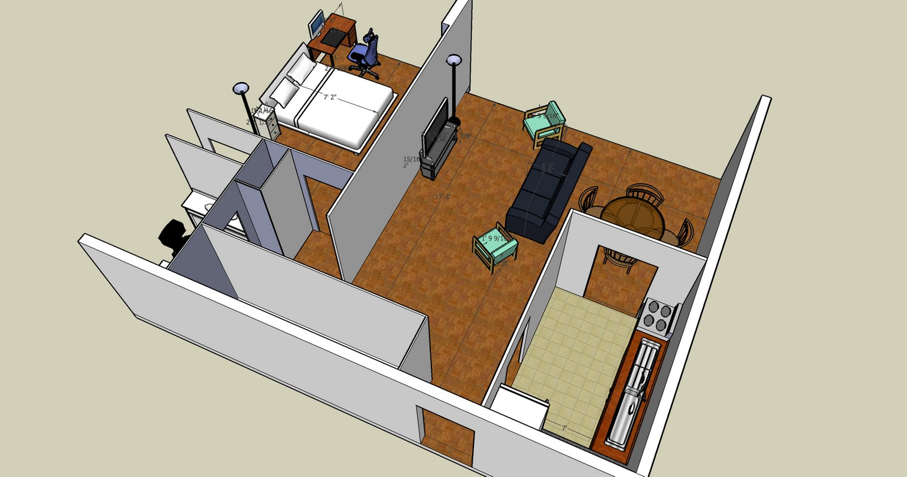
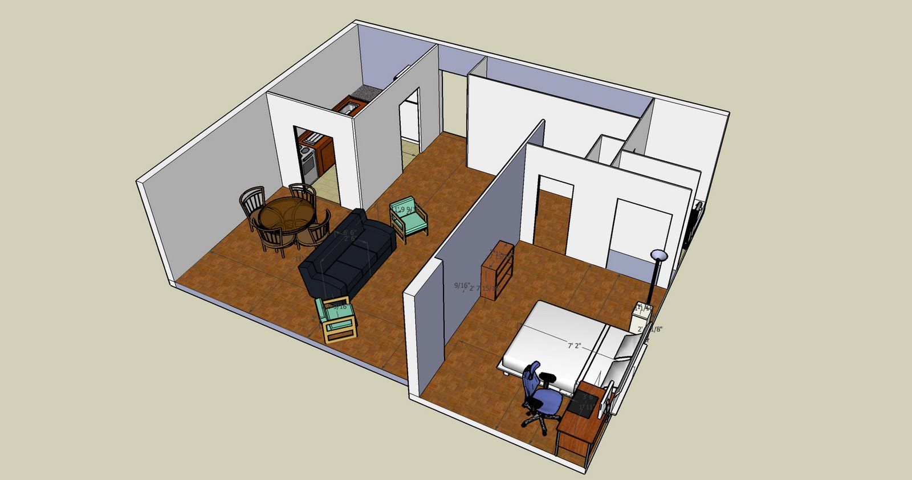
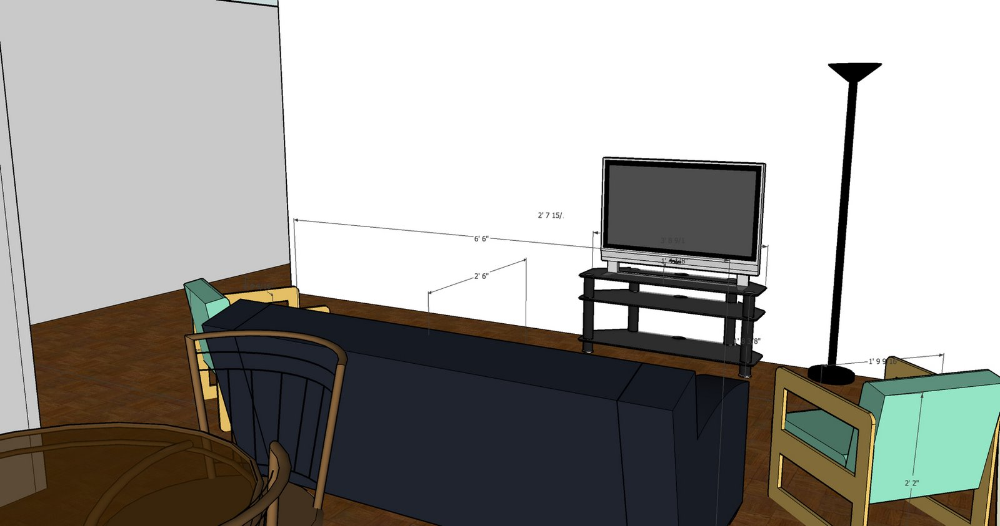
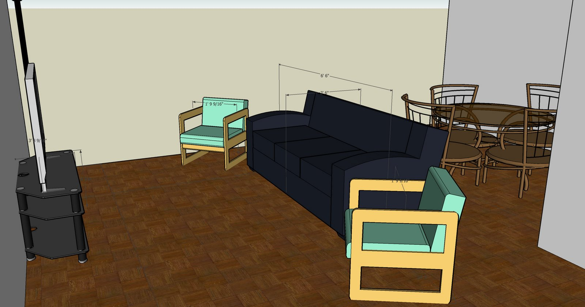
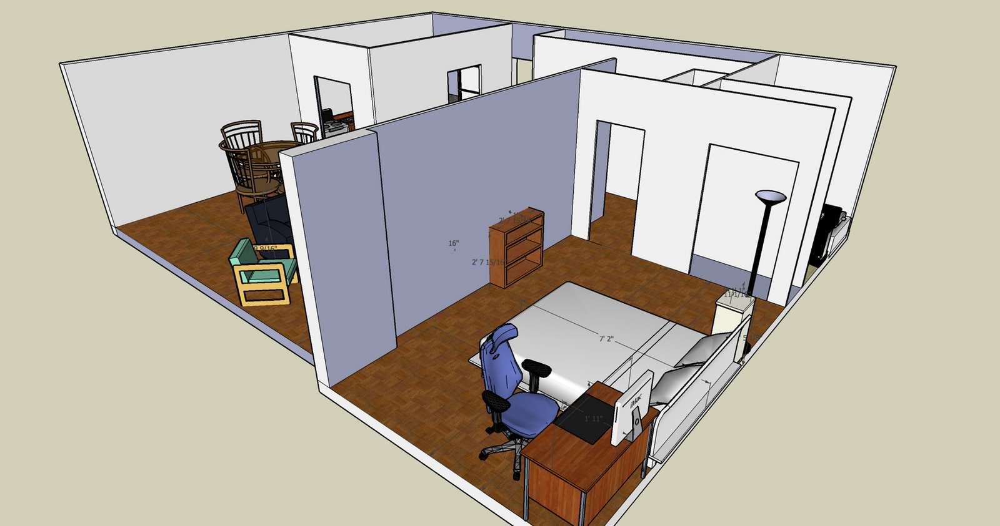
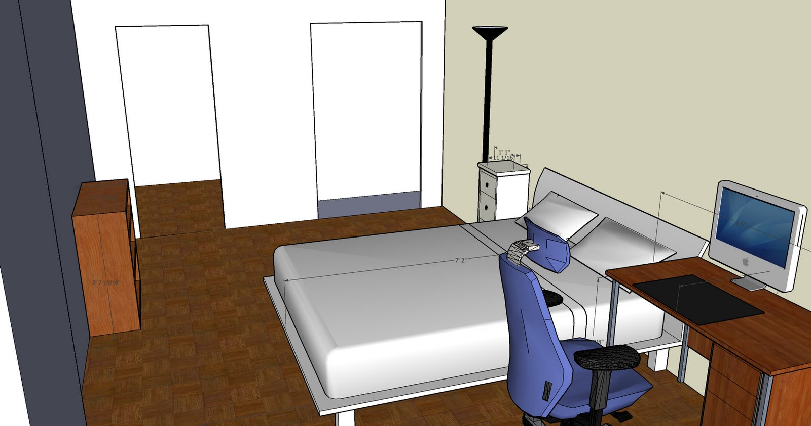

_N.B.: I don't normally post personal items on this blog, so this will be thinly disguised as a technology review article._  
  
I'm moving into my own apartment soon, and I'm pretty excited about it. In preparation, I've been shopping for some furniture, as well as thinking about how I'm going to arrange the furniture in the limited space that I have. When I was at IKEA, I saw booths set up where people were using some custom software to design their furniture layouts, and I thought it would be a good idea to try to do some "interior design" of my apartment using some 3D software to better visualize the space.  
  
I had heard good things about [Google SketchUp](http://google.com/sketchup), so I thought I would give that a shot. SketchUp is a pretty generic 3D modeling tool, but it seems like most people use it to create architectural designs. After watching some of the video tutorials on the site, and some experimentation with the interface, I was able to whip up something pretty quickly.  
  
Voila:

This is the living room.  

   
I'm considering maybe putting another shelf next to the TV for additional storage of books, DVDs, or whatever. On the other hand, it's good to have some empty space so that it's not too cluttered. There's also a pretty large storage closet in the apartment, so anything that doesn't need to always be conveniently available, I can just put in the closet.  
  
Here's the bedroom.  

 
The bedroom seemed small to me when I first looked at the floorplan and at the empty apartment, but now I've seen it in 3D with the furniture models, it's not so bad.  
  
So in conclusion: Google SketchUp is pretty good. Pretty, pretty good. 9/10  
  